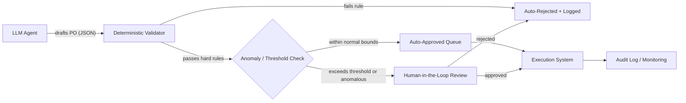

# Task 5 — Agentic AI: Prompt, Context & Harness Engineering for a Production Inventory Agent

## 1. The problem, reframed

The pilot agent failed in three distinct ways, and it's important to see that **they are three different failure modes, not one**:

| Symptom | Root cause | Which layer should have caught it |
|---|---|---|
| Hallucinated sales figures | The LLM was asked to *recall* numbers instead of *retrieve* them | **Context Engineering** |
| Ignored warehouse constraints | Constraints existed as prose in a prompt, not as enforced rules | **Prompt Engineering** (partially) + **Harness Engineering** (mainly) |
| Ordered 10,000 units of a discontinued product | Nothing outside the LLM validated the action before it executed | **Harness Engineering** |

This mapping matters because it tells you *where to invest*. Most teams over-invest in prompt tweaking and under-invest in the harness — but the harness is what turns "an LLM that's usually right" into "a system that's safe even when the LLM is wrong."

---

## 2. Prompt Engineering — shaping *what the model is asked to do*

Prompt engineering alone cannot guarantee reliability (LLMs will still occasionally err), so its job here is to **reduce the frequency and severity of errors**, not eliminate them.

- **Role & scope lock-in**: System prompt explicitly states the agent's authority boundary — e.g. "You draft purchase order *proposals*. You never have authority to execute an order. You may only reference figures returned by tool calls; you may never estimate, round, or infer a sales or stock number."
- **Structured output only**: Force the model to respond via a strict JSON schema / function call (e.g. `propose_purchase_order(sku, quantity, reasoning, source_data_ids)`), not free text. This makes downstream validation trivial and removes ambiguity about what the agent "meant."
- **Explicit negative constraints with examples**: Few-shot examples showing *both* a correct draft and a rejected draft (e.g. ordering a discontinued SKU), so the model has a concrete contrast rather than an abstract rule.
- **Mandatory citation of source**: Every numeric claim in the reasoning must reference a tool-call result ID. If a number in the output can't be traced to a tool call, the harness rejects it before it ever reaches a human.
- **Uncertainty verbalization**: Prompt requires the model to output a confidence/flag field ("data_gap: true") when required data wasn't available, instead of filling the gap with a guess.

Prompt engineering sets the *intent*. It's necessary but, on its own, not sufficient — it's a request, not a guarantee.

---

## 3. Context Engineering — shaping *what the model can see*

The hallucinated sales figures are a classic symptom of a model being asked to answer from parametric memory instead of grounded data. The fix is architectural, not verbal:

- **Retrieval over recollection**: The agent never "knows" sales or stock numbers. It must call tools — `get_sales_history(store_id, sku, window)`, `get_warehouse_stock(sku)`, `get_product_lifecycle_status(sku)` — and every number in its output must originate from a tool result, not from the model's own generation.
- **Freshness & provenance metadata**: Every retrieved record carries a timestamp and source system ID. Stale data (e.g. stock figures older than X hours) is flagged and either refreshed or excluded automatically before the model ever sees it.
- **Right-sized context, not maximal context**: Only the specific store's recent sales window, current stock, and lifecycle status are injected — not the entire national dataset. This reduces the chance of the model conflating figures across stores/SKUs.
- **Product lifecycle as first-class context**: Discontinued/end-of-life status is injected as a hard field (`status: "discontinued"`), not buried in a spreadsheet somewhere the model has to infer from. If it's a explicit field, it's easy to hard-block downstream (see Harness).
- **Context window hygiene**: Long-running agent sessions get summarized/pruned periodically so stale or irrelevant earlier context doesn't bleed into later decisions (a common cause of drift in long-horizon agents).

---

## 4. Harness Engineering — the part that actually makes this production-safe

This is the layer that matters most, because **it doesn't trust the LLM to be right — it assumes it will occasionally be wrong, and contains the blast radius.**

### 4.1 Propose → Validate → Approve → Execute pipeline

The LLM is only ever allowed to *propose*. It never has write access to procurement systems.

### 4.2 Deterministic guardrails (plain code, not another LLM call)

These are hard-coded, non-negotiable checks that run **outside** the model and cannot be prompted around:

- **Lifecycle check**: reject any order where `product_status != "active"`.
- **Stock-vs-demand sanity bounds**: reject/flag if `order_quantity > N × trailing_avg_demand` (catches the 10,000-unit case regardless of the model's reasoning).
- **Warehouse capacity constraint**: reject if `order_quantity > available_warehouse_capacity`.
- **Budget ceiling per store/per SKU/per time window.**
- **Schema validation**: malformed or incomplete tool-call chains (missing source citations) are rejected outright.

### 4.3 Human-in-the-loop, calibrated by risk

Not every order needs a human. Route by risk score:
- Low-value, in-pattern, low-quantity orders → auto-approved.
- High-value, first-time, or statistically anomalous orders → routed to a regional manager for one-click approve/reject, with the agent's reasoning and cited data shown alongside.

### 4.4 Observability & audit trail

- Every decision logs: input context, tool calls made, model output, validator result, final action, and (if applicable) human reviewer decision.
- This creates a dataset for continuous evaluation and makes root-cause analysis of any future incident possible in minutes, not days.

### 4.5 Pre-deployment evals & regression testing

- Before any prompt/model update ships, run it against a fixed suite of historical scenarios (including past failure cases: the discontinued-SKU case, known hallucination triggers) as an automated regression test — similar to unit tests, but for agent behavior.
- Adversarial/red-team scenarios specifically targeting the three known failure modes are added permanently to this suite.

### 4.6 Fail-safe defaults

- If a required tool call fails or returns stale/missing data, the agent's *only* valid action is to abstain and escalate — never to guess and proceed. This is enforced by the harness (e.g., the validator rejects any proposal missing a required source citation), not just requested in the prompt.

### 4.7 Continuous monitoring in production

- Track drift metrics: rate of human overrides, rate of validator rejections, distribution of order sizes vs. historical baseline.
- A rising override/rejection rate is an early warning that the model or data pipeline has drifted, well before it causes a costly mistake.

---

## 5. Summary

| Layer | Answers the question | Key mechanism |
|---|---|---|
| **Prompt Engineering** | "What is the model told to do?" | Structured output, explicit constraints, cited-reasoning requirement |
| **Context Engineering** | "What does the model actually see?" | Tool-based retrieval, lifecycle status as first-class data, freshness checks |
| **Harness Engineering** | "What happens around the model regardless of what it outputs?" | Deterministic validation, risk-tiered human approval, audit logging, regression evals, fail-safe abstention |

The core principle: **treat the LLM as a proposer of intent operating inside a system that never fully trusts it.** Reliability doesn't come from making the model "smarter" — it comes from making the surrounding system incapable of executing an unsafe action, no matter what the model outputs.
